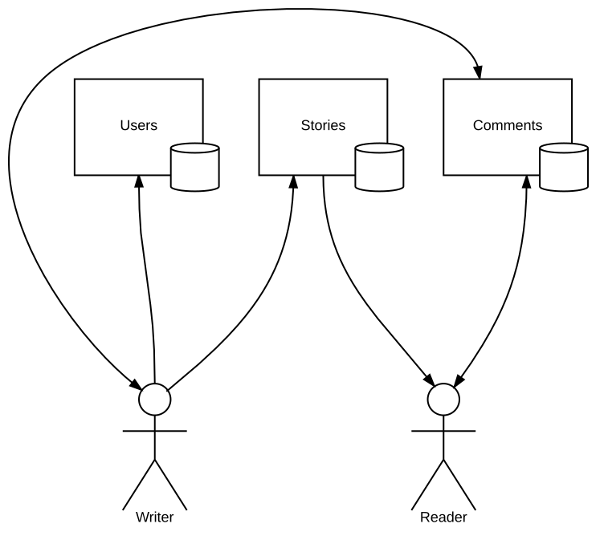
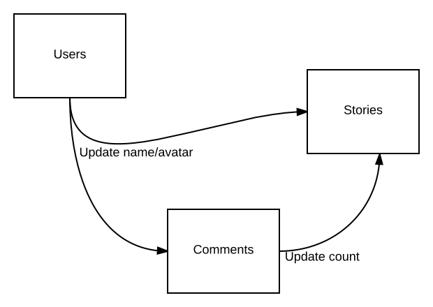
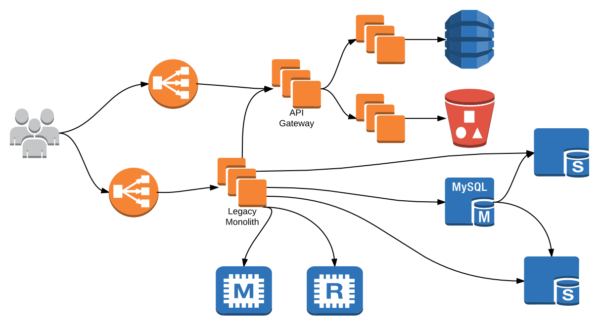
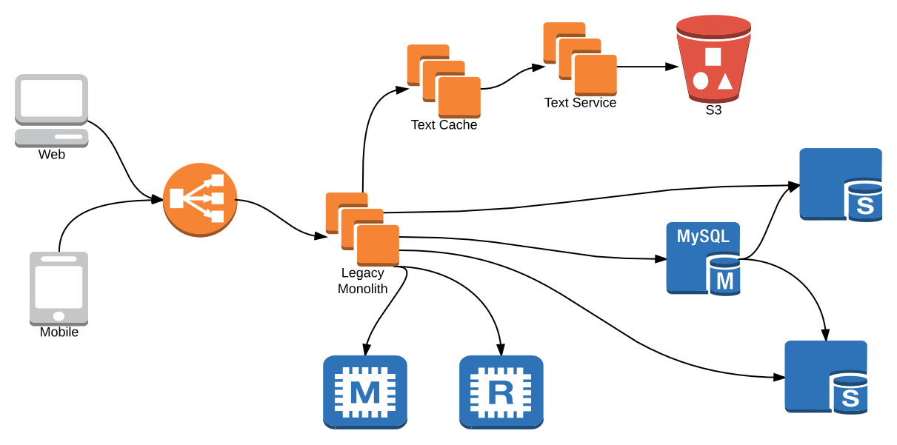

title: Losing count of a billion comments - Choreographing microservices @ Wattpad
author:
  name: Jonathan Harlap
  twitter: jharlap
  github: jharlap
  email: "jonathan.harlap@wattpad.com"
theme: sjaakvandenberg/cleaver-light

--

# Losing count of a billion comments
## Choreographing microservices @ Wattpad

--

### Storytelling at scale

 lets people discover and share stories about the things they love.

- 45 million monthly audience
- 15 billion reading minutes per month
- 200+ million story uploads
- 25 hours written per minute
- 50+ languages
- 35k QPS @ internet-facing load balancer (web frontend + APIs)

And a billion comments...

--

### Comments

  

  

--

# Chorography vs Orchestration

--

### Orchestration

> In a distributed system, "a local view from the perspective of one participant". A manager coordinates the actions of many supporting actors to complete a task.

Controller service (API gateway) fetches content from many dependencies, aggregates results into a single response for client.

- Many points of failure
- Many internal requests to process one client request
- Favours consistency over availability

--

### Choreography

> "Coordination from a global multi-participant perspective, without a central controller." Each actor both publishes events of potential interest to other actors and subscribes to events of interest from other actors. A task is completed when all supporting actors have finished reacting to the seed event and all consequently published events.

Each service has all data necessary to process a request, broadcast updates to other services.

- Durable message queue is critical for updates
- Queries depend on only *one* service
- Favours availability over consistency
- Clients correlating content from multiple services can see inconsistencies 😢

--

### Choreography

--

### Choreography

--

# Distributed State

--

### Surprisingly Stateful

--

### 45M node distributed system

--

# Messaging

--

### Reliable Messaging

Given unreliable infrastructure, and message-passing services, do you have...

- Exactly once delivery? At least once? At most once?
- In order delivery? Out of order?
- Retry failed deliveries?

Options:
- **NATS:** At most once, in order, no retries (IIRC)
- **SQS:** At least once, out of order, retries.
- **RabbitMQ:** The kitchen sink, and even more ops pain!
- **Kafka:** Never speak of this to me. (mostly kidding)

--

# Is it better to have magic in your messaging system, or code in your application?

--

### Message Processing

| If you have this anomaly | Processing must be...     |
|--------------------------|---------------------------|
| Out of order messages    | Commutative               |
| Duplicate messages       | Idempotent                |
| Distributed merges       | Associative & Commutative |
| At most once delivery    | Able to recover lost messages 🌈🦄 |

**Intelligent message processing allows simple messaging infrastructure**

--

### Conflict-free Replicated Data Types

State-based CRDTs (a.k.a. convergent RDTs, CvRDTs) transfer **complete state**
* Defines 3 functions
  * Update modifies local state
  * Query reads a value
  * Merge accepts remote updates
* High bandwidth usage but minimal network layer guarantees (cannot lose messages)

Merge functions must be:
* Associative: *m(A, B) = m(B, A)*
* Commutative: *m(m(A, B), C) = m(A, m(B, C))*
* Idempotent: *m(A, A) = A*

Merge function example: MAX

--

### Some Known CRDTs

* LWW Register
* G-counter
* PN-counter
* G-set (a.k.a. 1P-set)
* 2P-set
* OR-set
* ... more sets, graphs, sequences

--

# <a href="https://github.com/Wattpad/sqsconsumer">github.com/Wattpad/sqsconsumer</a>

--

### sqsconsumer

A MessageHandlerFunc will be invoked for every message received:

`type MessageHandlerFunc func(ctx context.Context, msg string) error`

A MessageHandlerDecorator facilitates creating messaging middleware:

`type MessageHandlerDecorator func(sqsconsumer.MessageHandlerFunc) sqsconsumer.MessageHandlerFunc`

`middleware.DefaultStack(ctx, sqs)` sets up sane defaults: Let processing run as long as necessary & retry messages on handler error.

`sqsconsumer.NewConsumer(sqs, handler).Run(ctx)` runs a consumer loop: Receive messages in batches (save $), graceful exit on ctx.Done(), handler goroutine per message, backpressure.

--

### CRDTs & SQS: Happy Happy Joy Joy!

sqsconsumer message handler = CRDT merge function

Associative, commutative, idempotent message processing!

Out of order? Duplicate delivery? Retries? Delays? **No Problem!**

Expect little of the queue, so switching queue is trivial. Only demand _at least once delivery_ - lost messages invalidate everything.

--

### Resources

* [sqsconsumer](https://github.com/Wattpad/sqsconsumer)
* [Distributed Systems for fun and profit]( http://book.mixu.net/distsys/ )
* Conflict-free Replicated Data Types
  * [Strong Eventual Consistency and CRDTs (video + slides)](http://research.microsoft.com/apps/video/default.aspx?id=153540)
  * [A comprehensive study of CRDTs (paper)](https://hal.inria.fr/inria-00555588)
* Databases
  * [Jensen: Partition tolerance analysis of DBs](https://aphyr.com/tags/jepsen)
  * [The Declarative Imperative](http://www.eecs.berkeley.edu/Pubs/TechRpts/2010/EECS-2010-90.pdf)
  * [Probabilistically Bounded Staleness for Practical Partial Quorums](http://pbs.cs.berkeley.edu/pbs-vldb2012.pdf)
* Time
  * [Time, clocks, and the ordering of events in a distributed system]( http://research.microsoft.com/en-us/um/people/lamport/pubs/time-clocks.pdf )
  * [Dotted Version Vectors: Efficient Causality Tracking for Distributed Key-Value Stores](http://gsd.di.uminho.pt/members/vff/dotted-version-vectors-2012.pdf)
  * [How to Have your Causality and Wall Clocks, too]( https://youtu.be/YqNGbvFHoKM )
  * [Interval Tree Clocks: A Logical Clock for Dynamic Systems]( http://gsd.di.uminho.pt/members/cbm/ps/itc2008.pdf )

--

# Thanks! Questions?
